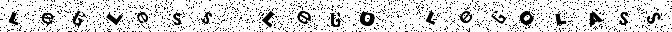
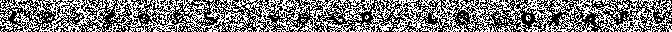
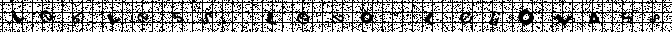

**Generated data sets**

- resources/output/alphabet_1
    * full alphabet
    * lowercase + uppercase
    * 100 samples per letter
    * 100px * 100px image
    * boxpot.tff font
    * no noise
    * no grid

- resources/output/alphabet_3
    * full alphabet
    * lowercase + uppercase
    * 1000 samples per letter
    * 32px * 32px image
    * boxpot.ttf  font
    * no noise
    * no grid

- resources/output/alphabet_4
    * full alphabet
    * lowercase
    * 1000 samples per letter
    * 32px * 32px image
    * boxpot.ttf  font
    * noise level 1/10
    * no grid

- resources/output/alphabet_5
    * full alphabet
    * lowercase
    * 1000 samples per letter
    * 32px * 32px image
    * boxpot.ttf  font
    * noise level 2/10
    * no grid

- resources/output/alphabet_6
    * full alphabet
    * lowercase
    * 1000 samples per letter
    * 32px * 32px image
    * boxpot.ttf  font
    * noise level 5/10
    * no grid

- resources/output/alphabet_7
    * full alphabet
    * lowercase
    * 1000 samples per letter
    * 32px * 32px image
    * boxpot.ttf  font
    * no noise
    * grid on, size 10px

- resources/output/alphabet_8
    * full alphabet
    * lowercase
    * 1000 samples per letter
    * 32px * 32px image
    * boxpot.ttf  font
    * noise level 1/10
    * grid on, size 10px

- resources/output/alphabet_9
    * full alphabet
    * lowercase
    * 1000 samples per letter
    * 32px * 32px image
    * boxpot.ttf  font
    * noise level 2/10
    * grid on, size 10px

